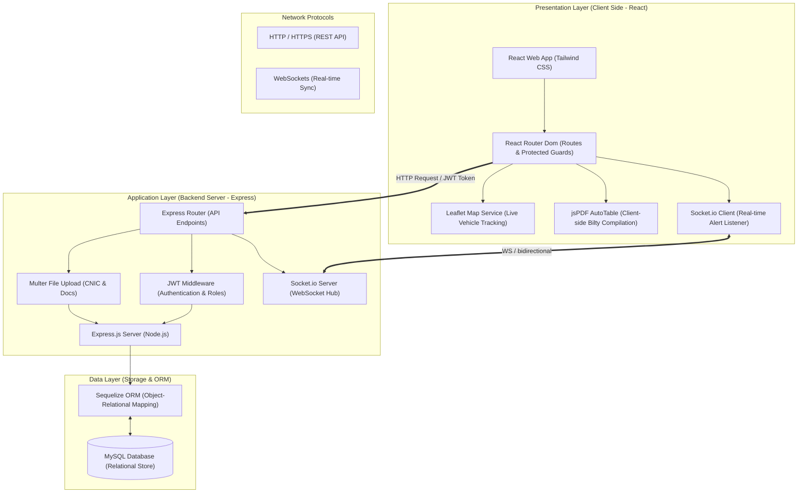
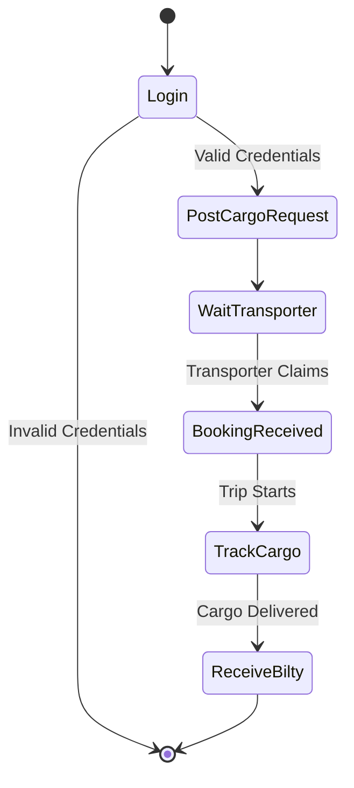
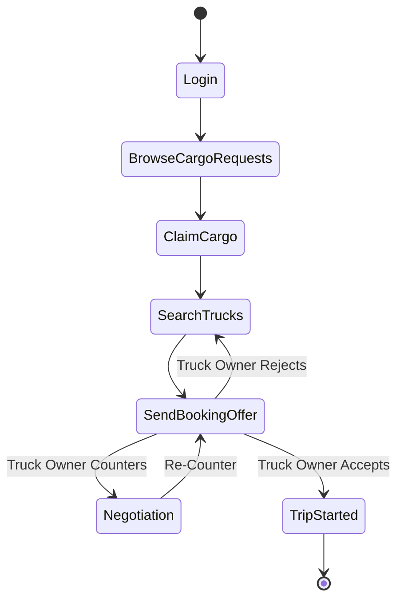
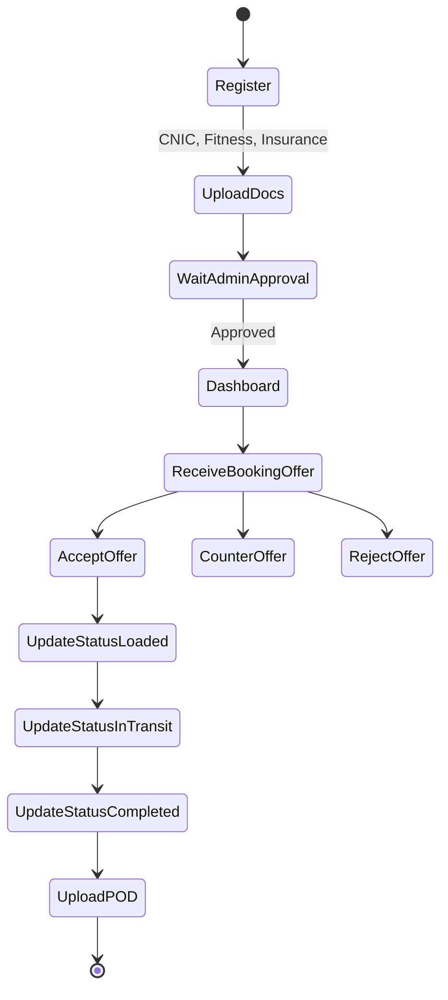
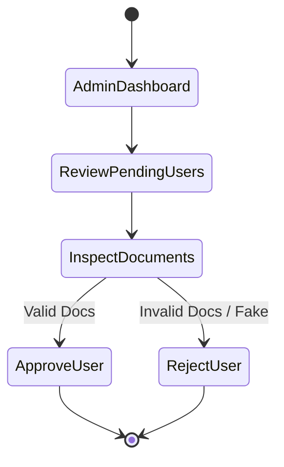
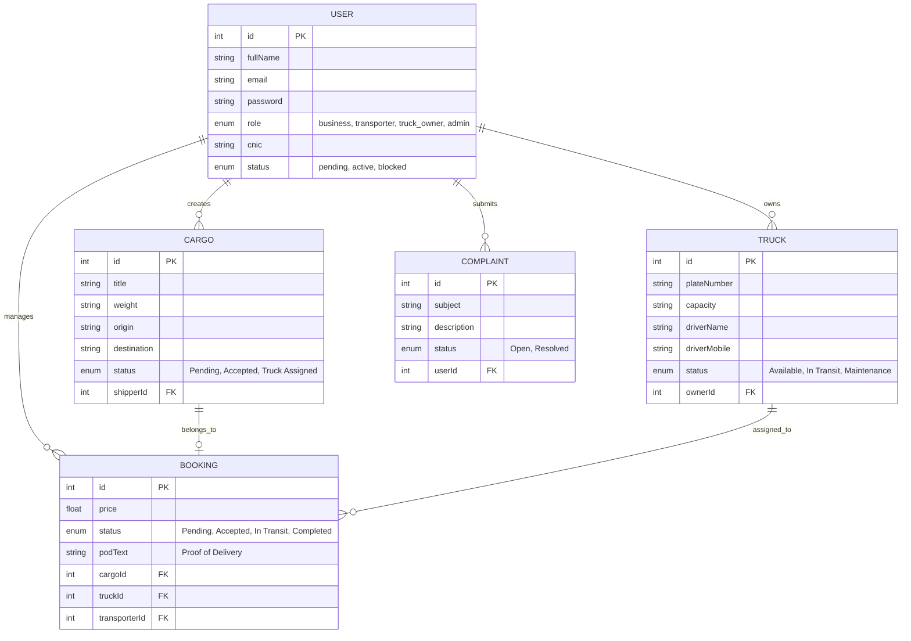

# E-Cargo-Bilty: Digital Logistics and E-Bilty Management System

**By:**
*   Nouman Ashfaq (46488)
*   M. Waleed (46202)
*   Sauod Azad (46334)

**Supervised by:**
*   Mr. Sadaqat Ali

**Faculty of Computing**
**Riphah International University, Islamabad**
*Spring 2026*

---

## Final Approval
This is to certify that we have read the report submitted by **Nouman Ashfaq (46488)**, **M. Waleed (46202)**, and **Sauod Azad (46334)** for the partial fulfillment of the requirements for the degree of *Bachelors of Science in Software Engineering (BSSE)*. It is our judgment that this report is of sufficient standard to warrant its acceptance by Riphah International University, Islamabad.

**Committee:**
1.  **Mr. Sadaqat Ali** (Supervisor)
2.  **Dr. Musharaf Ahmed** (Head of Department)

---

## Declaration
We declare that this report, "E-Cargo-Bilty," is entirely our own work and has not been copied from any other source. We have put in our personal efforts to complete this project and write this report. Our supervisor, Mr. Sadaqat Ali, guided us throughout the process. We confirm that no part of this work has been taken from any other project or published source without proper acknowledgment. 

*   *Nouman Ashfaq (46488)*
*   *M. Waleed (46202)*
*   *Sauod Azad (46334)*

---

## Dedication
We dedicate this work to our parents and families, whose prayers, patience, and support made this journey possible. We also dedicate it to our teachers, especially our supervisor **Mr. Sadaqat Ali**, who guided us with patience and helped us improve at every step. Finally, to our friends and batch mates who kept us motivated throughout this semester.

---

## Acknowledgement
First and foremost, we thank Allah Almighty for giving us the strength and ability to complete this project. We are grateful to our parents for their constant support and encouragement throughout our studies.

We would like to express our sincere thanks to our supervisor, **Mr. Sadaqat Ali**, Senior Lecturer, Faculty of Computing, Riphah International University, for his guidance, feedback, and patience during every phase of this project. His support helped us stay on track and improve the quality of our work. 

---

## Abstract
**E-Cargo-Bilty** is a web-based digital logistics and electronic consignment note platform built for the shipping and cargo industry in Pakistan. Currently, the local logistics market relies on paper-based lorry receipts (Bilties) to manage transactions between Shippers (Business Owners), Brokers (Transporters), and Truck Owners. These paper workflows lead to severe operational issues, including physical receipt loss, pricing disputes, lack of real-time transit visibility, and manual verification overhead. 

To resolve this, E-Cargo-Bilty provides a unified digital space where:
1.  **Business Owners** can request shipments and download digital bilties.
2.  **Transporters** can claim shipments, find trucks, and coordinate bookings.
3.  **Truck Owners** can register vehicles and negotiate rates via counter-offers.
4.  **Administrators** can verify registration documents (CNICs, business licenses) to prevent fraud.

The platform generates verified, downloadable PDF Bilties using `jsPDF`, tracks shipments on interactive maps using `react-leaflet`, and supports real-time status alerts and private chats using `Socket.io`. The application is developed with a React frontend, a Node.js/Express backend, and a Sequelize/MySQL database layer. By automating logistics workflows and digitizing consignment records, E-Cargo-Bilty minimizes paperwork, prevents cargo fraud, and streamlines transit coordination.

---

# Chapter 1: Introduction

## 1.1 Overview
**E-Cargo-Bilty** is a digital logistics platform designed to modernize the traditional cargo shipping and consignment note (Bilty) workflow in Pakistan. The core purpose of the system is to digitize the logistics brokerage process, enabling Shippers, Transporters, and Truck Owners to interact on a single, secure web application.

Currently, cargo distribution relies on physical papers. A transporter writes down consignment details on a printed template, signs it, and passes it to the driver. When the cargo arrives, the consignee signs the paper copy to confirm delivery. E-Cargo-Bilty replaces this paper document with a secure, system-generated digital PDF Bilty, complete with dynamic verification states, automated freight calculations, and digital driver signatures. 

The application utilizes a role-based structure divided into four panels:
*   **Business Dashboard:** Shippers create cargo requests, track trip progression, and obtain proof of delivery.
*   **Transporter Dashboard:** Logistics brokers review active shipper listings, match them with available trucks, and manage booking cycles.
*   **Truck Owner Dashboard:** Fleet owners register trucks, view incoming trip offers, offer price counters, and update transit states.
*   **Admin Control Center:** Platform administrators inspect registration documents (CNICs, licenses), approve users, resolve system complaints, and monitor fleet utilization.

## 1.2 Opportunity and Stakeholders
The Pakistani logistics sector lacks a standardized, free-to-use digital system for small-to-medium transporters. Brokers spend hours making phone calls to negotiate truck rates, while business owners have no way of knowing where their cargo is during transit. Furthermore, fraud (such as fake truck plates or fake drivers stealing goods) is highly prevalent due to the absence of a verified registration process. E-Cargo-Bilty presents a massive opportunity to digitize this sector, secure transactions, and automate notifications.

### 1.2.1 Stakeholders
1.  **Business Owners (Consignors):** Shippers requiring bulk cargo transportation.
2.  **Cargo Transporters:** Middlemen/brokers who coordinate logistics.
3.  **Truck Owners:** Fleet managers providing physical vehicles and drivers.
4.  **System Administrators:** Operators managing user verification and disputes.
5.  **Receivers (Consignees):** Final recipients who verify cargo delivery.

## 1.3 Motivations and Challenges
### 1.3.1 Motivations
1.  **Paper Elimination through Digitization:** Replacing traditional printed bilties with automated PDF generation to prevent document damage or loss.
2.  **Accountability & Verification:** Restricting platform access to verified users who upload valid identification documents.
3.  **Real-Time Negotiation:** Replacing endless phone calls with a digital chat and counter-offer system for booking requests.
4.  **Tracking Visibility:** Providing map-based coordinates showing current vehicle states during transit.

### 1.3.2 Challenges
1.  **Industry Adoption:** Convincing non-technical truck owners and drivers to use a web application.
2.  **Document Security:** Ensuring that uploaded CNICs, driver licenses, and vehicle insurance files are stored securely.
3.  **State Synchronicity:** Using WebSockets to coordinate immediate pricing and status updates across multiple user roles.

## 1.4 Goals and Objectives
*   **Single Unified Logistics Hub:** Provide one portal to handle all freight listings, truck management, price negotiation, and billing.
*   **Prevent Cargo Fraud:** Enforce strict document checks where accounts are manually verified by an Admin before transacting.
*   **Digital Bilty Automation:** Automatically compile transaction details into a downloadable PDF consignment note with a "Verified" watermark.
*   **Real-time Alerting:** Deliver immediate booking and transit notifications to the respective stakeholders using Socket.io.

## 1.5 Solution Overview
E-Cargo-Bilty is a full-stack Javascript application. The frontend is built on **React 19** and **Vite**, utilizing **Tailwind CSS** for a premium glassmorphic dark interface. The backend uses **Node.js** and **Express.js**, connected to a **MySQL** database via **Sequelize ORM**. Real-time communication and chat notifications are powered by **Socket.io**. PDF Bilties are compiled on the client side using **jsPDF** and **jsPDF-AutoTable**.

## 1.6 Scope of the Project
*   **For Shippers (Business Owners):** Login, post cargo requests, track active cargo on Leaflet maps, download digital bilties, and view transit notifications.
*   **For Transporters:** Register, claim cargo requests, search for available trucks, create booking offers, chat with truck owners, accept counter-offers, and view overall trip logs.
*   **For Truck Owners:** Register, upload driver details and vehicle documents (fitness, insurance), receive bookings, submit price counter-offers, update trip states (Pending -> Loaded -> In Transit -> Completed), and upload Proof of Delivery (POD).
*   **For Admins:** View platform metrics (total bilties, user role counts, truck utilization rate), verify pending user registrations, block/unblock users, and resolve user complaints.

---

# Chapter 2: Market Survey

## 2.1 Introduction
To justify the development of E-Cargo-Bilty, we analyzed existing logistics and booking platforms. We focused on identifying what features they offer, their limitations, and the specific operational requirements of the Pakistani logistics market that remain unaddressed.

## 2.2 Literature Review
We compared paper-based workflows with three global and regional digital logistics solutions:
1.  **Traditional Paper Bilty Workflow (Pakistan):** Entirely manual, zero real-time tracking, high risk of paperwork loss, and no centralized verification.
2.  **Uber Freight (US/Global):** Highly advanced automated dispatcher, but requires expensive subscription fees and is unavailable in South Asia.
3.  **Trukker (Middle East & Pakistan):** Enterprise-focused logistics aggregator, but operates as a closed B2B network where small independent transporters cannot directly register, negotiate, and generate bilties for free.

## 2.3 Summary & Comparison Table
E-Cargo-Bilty fills these market gaps by providing a free, open-access broker platform customized with localized Bilty PDF layouts and a real-time price negotiation engine.

### Table 2.1: Comparison of Logistics Platforms
| Feature | Paper Bilty | Uber Freight | Trukker | E-Cargo-Bilty |
| :--- | :---: | :---: | :---: | :---: |
| **Digital Bilty PDF Generation** | ✗ | ✓ | ✓ | **✓ (Custom Localized)** |
| **P2P Price Negotiation** | ✓ (Phone only) | ✗ (Fixed Price) | ✗ (Fixed Price) | **✓ (Counter-Offer Chat)** |
| **Independent Driver Registration**| ✗ | ✓ | ✗ (Fleet only) | **✓ (Open Registration)** |
| **KYC / Document Verification** | ✗ | ✓ | ✓ | **✓ (Admin Panel)** |
| **Free Open Access** | ✗ (Paper cost) | ✗ | ✗ | **✓ (Open Source)** |
| **Real-Time Map Integration** | ✗ | ✓ | ✓ | **✓ (React-Leaflet)** |

---

# Chapter 3: Requirement Engineering

## 3.1 Introduction
This chapter details the engineering specifications of the E-Cargo-Bilty platform. We start with three problem scenarios representing traditional cargo pain points, followed by detailed functional and non-functional requirements. The chapter concludes with formal SQA test cases designed via equivalence partitioning.

## 3.2 Problem Scenarios

### Table 3.1: Scenario 1 - Lack of Real-Time Cargo Visibility
| Attribute | Description |
| :--- | :--- |
| **The Problem of** | Lack of Real-Time Cargo Visibility |
| **Affects** | Business Owners (Shippers) and Transporters |
| **The Result of Which** | Shippers must make repeated phone calls to drivers to find out shipment locations, leading to delayed updates and scheduling disputes. |
| **Benefit of** | Real-time map rendering showing transit status (`In Transit`, `Loaded`, `Delivered`) and vehicle location. |

### Table 3.2: Scenario 2 - Consignment Note Damage and Loss
| Attribute | Description |
| :--- | :--- |
| **The Problem of** | Consignment Note (Bilty) Damage and Loss |
| **Affects** | Transporters and Consignees |
| **The Result of Which** | Physical papers get lost, wet, or torn during long transit routes, resulting in payment delays and invoice issues. |
| **Benefit of** | Instant download of digital, verified PDF Bilties containing unique cryptographic transaction IDs. |

### Table 3.3: Scenario 3 - Unverified Drivers and Cargo Theft
| Attribute | Description |
| :--- | :--- |
| **The Problem of** | Unverified Drivers and Cargo Theft |
| **Affects** | Business Owners and Platform Reputation |
| **The Result of Which** | Unscrupulous users register with fake license plates and steal high-value cargo without trace. |
| **Benefit of** | Admin KYC checking, requiring users to upload CNIC and registration documents before receiving cargo access. |

---

## 3.3 Functional Requirements

### 3.3.1 Business Owner (Shipper)
*   **FR-01 (Authentication):** Shippers shall register and login with their business details.
*   **FR-02 (Cargo Management):** Shippers shall create cargo listings containing title, weight, origin, destination, and product specifics.
*   **FR-03 (Tracking):** Shippers shall monitor their active shipments on a Leaflet map.
*   **FR-04 (Bilty Retrieval):** Shippers shall view and download digital PDF Bilties once a truck is assigned and completed.
*   **FR-05 (Notifications):** Shippers shall receive real-time updates when cargo is loaded, in transit, or delivered.

### 3.3.2 Cargo Transporter (Broker)
*   **FR-06 (Shipment Assignment):** Transporters shall view and claim cargo requests posted by Shippers.
*   **FR-07 (Truck Search):** Transporters shall search for registered trucks filtering by location, capacity, and availability status.
*   **FR-08 (Booking Negotiation):** Transporters shall send booking offers to truck owners with a proposed freight price.
*   **FR-09 (Chat Integration):** Transporters shall chat with Truck Owners inside a booking detail panel to finalize cargo terms.
*   **FR-10 (Counter-Offers):** Transporters shall accept or reject price counter-offers submitted by Truck Owners.

### 3.3.3 Truck Owner
*   **FR-11 (Fleet Registration):** Truck Owners shall register trucks specifying plate number, cargo capacity, driver details, and current location.
*   **FR-12 (Document Upload):** Truck Owners shall upload verification documents (CNIC, truck fitness, and vehicle insurance).
*   **FR-13 (Booking Response):** Truck Owners shall accept, reject, or submit price counter-offers to incoming booking requests.
*   **FR-14 (Transit Tracking):** Truck Owners shall change shipment states (`Loaded`, `In Transit`, `Completed`).
*   **FR-15 (Proof of Delivery):** Truck Owners shall submit text-based Proof of Delivery (POD) details to close out a booking.

### 3.3.4 System Administrator
*   **FR-16 (KYC Management):** Administrators shall view all pending user profiles and uploaded documents.
*   **FR-17 (Account Operations):** Administrators shall approve, reject (providing a reason), suspend, or block user accounts.
*   **FR-18 (System Statistics):** Administrators shall view aggregate stats, including active shipments, total bilties, user role distribution, and monthly cargo counts.
*   **FR-19 (Dispute Management):** Administrators shall view system-wide complaints and mark them as resolved after coordination.

---

## 3.4 Non-Functional Requirements
*   **NFR-01 (Security):** All passwords must be hashed using bcrypt (10 rounds). API routes must be protected using JSON Web Tokens (JWT) inside HTTP Authorization headers.
*   **NFR-02 (Performance):** Map marker rendering must load within 2 seconds using Leaflet client-side clusters. Bilty PDF compilation must execute entirely on the client browser.
*   **NFR-03 (Aesthetics):** The UI must utilize glassmorphic panels, neon borders, and dark themes to ensure a premium user experience.

---

## 3.5 SQA Activities: Defect Detection

We applied equivalence partitioning to verify the validation logic of our modules.

### 3.5.1.1 User Registration

#### Table 3.4: Test Cases for User Registration
| Input | Valid Class | Invalid Class |
| :--- | :--- | :--- |
| **Full Name** | String length between 2 and 100 characters | Empty name, or string length > 100 |
| **Email Address** | Standard syntax (`user@domain.com`) | Missing `@` symbol, missing domain extension |
| **Role Select** | Matches ENUM values: `business`, `transporter`, `truck_owner`, `admin` | Any other value or null selection |
| **CNIC Number** | 13-digit numeric string (no hyphens) | Contains letters, or length not equal to 13 |
| **Password** | String length >= 8 characters | String length < 8 characters |

### 3.5.1.2 User Login

#### Table 3.5: Test Cases for User Login
| Input | Valid Class | Invalid Class |
| :--- | :--- | :--- |
| **Email Address** | Registered email in the database | Email not registered in the system |
| **Password** | Correct matching password | Incorrect password matching |
| **Account Status** | User status is `active` | User status is `pending`, `rejected`, or `blocked` |

### 3.5.1.3 Truck Registration

#### Table 3.6: Test Cases for Truck Registration
| Input | Valid Class | Invalid Class |
| :--- | :--- | :--- |
| **Plate Number** | Alphanumeric plate identifier (e.g. `LEC-1234`) | Empty string |
| **Capacity** | Non-empty string representing weight (e.g. `20 tons`) | Empty capacity entry |
| **Coordinates** | Valid coordinates array `[latitude, longitude]` | Latitude outside `[-90, 90]`, longitude outside `[-180, 180]` |
| **Driver Mobile**| Numeric string (11 digits, e.g. `03001234567`) | Contains letters, or length != 11 |

### 3.5.1.4 Cargo Creation

#### Table 3.7: Test Cases for Creating Cargo
| Input | Valid Class | Invalid Class |
| :--- | :--- | :--- |
| **Title** | Non-empty string between 2 and 200 characters | Empty title, or title exceeds 200 characters |
| **Weight** | String indicating cargo weight (e.g. `15 tons`) | Empty weight entry |
| **Origin** | Existing city/location description | Empty origin field |
| **Destination** | Existing city/location description | Empty destination field |

### 3.5.1.5 Booking Creation

#### Table 3.8: Test Cases for Creating Bookings
| Input | Valid Class | Invalid Class |
| :--- | :--- | :--- |
| **Price** | Positive numeric string (e.g. `75000`) | Negative value, empty, or alphabetical characters |
| **Truck Status** | Assigned truck status is `Available` | Assigned truck status is `In Transit` or `Maintenance` |
| **Cargo Status** | Cargo status is `Accepted` or `Pending` | Cargo status is already `Truck Assigned` or `In Transit` |

### 3.5.1.6 Price Counter-Offer

#### Table 3.9: Test Cases for Submitting Counter-Offers
| Input | Valid Class | Invalid Class |
| :--- | :--- | :--- |
| **Counter Price** | Positive numeric value different from original price | Negative values, non-numeric strings, or equal to original |
| **Booking State** | Booking status is `Pending` | Booking status is `Accepted`, `In Transit`, or `Completed` |

### 3.5.1.7 Proof of Delivery (POD) Upload

#### Table 3.10: Test Cases for Submitting POD
| Input | Valid Class | Invalid Class |
| :--- | :--- | :--- |
| **POD Text** | Non-empty description string (e.g. `Received by Manager`) | Empty text input |
| **Booking State** | Booking status is `In Transit` | Booking status is `Pending`, `Rejected`, or `Completed` |

### 3.5.1.8 System Complaint Registration

#### Table 3.11: Test Cases for Registering Complaints
| Input | Valid Class | Invalid Class |
| :--- | :--- | :--- |
| **Subject** | Non-empty string, length 2 to 200 characters | Empty subject, or exceeds 200 characters |
| **Description** | Detailed explanation of the issue | Empty description field |
| **User ID** | Authenticated sender user ID | Unauthenticated sender |

---

# Chapter 4: System Design

## 4.1 Introduction
This chapter describes how E-Cargo-Bilty is designed. It includes the system architecture showing how the frontend, backend, and database are organized, along with a 3-Tier diagram illustrating the layered design.

## 4.2 Architectural Design
The architecture of E-Cargo-Bilty is designed using a modern web stack.

### Architecture Diagram


## 4.3 3-Tier Diagram
The application strictly follows a 3-tier architecture separating the client interface, the business logic, and the persistent data storage.

```mermaid
graph LR
    subgraph Client_Tier["Tier 1: Presentation (Frontend)"]
        React["React.js SPA"]
    end

    subgraph Logic_Tier["Tier 2: Application (Backend)"]
        Node["Node.js + Express API"]
    end

    subgraph Data_Tier["Tier 3: Data (Database)"]
        SQL["MySQL Database"]
    end

    React <-->|JSON over HTTP / WS| Node
    Node <-->|SQL Queries (Sequelize)| SQL
```

## 4.4 Activity Diagrams
The following activity diagrams illustrate the flow of actions for different user roles in the E-Cargo-Bilty system.

### 4.4.1 Business Owner (Shipper) Activity
This diagram shows the process of a business owner posting a cargo request and tracking it until delivery.



### 4.4.2 Transporter (Broker) Activity
This diagram illustrates the transporter finding cargo, finding a truck, and creating a booking.



### 4.4.3 Truck Owner Activity
This diagram shows the truck owner registering, accepting bookings, and updating the transit status.



### 4.4.4 Admin Activity
This diagram shows how an admin verifies new registrations.



## 4.5 Entity Relationship Diagram (ERD)
The following Entity Relationship Diagram (ERD) illustrates the core database entities and their relationships within the E-Cargo-Bilty database schema.


